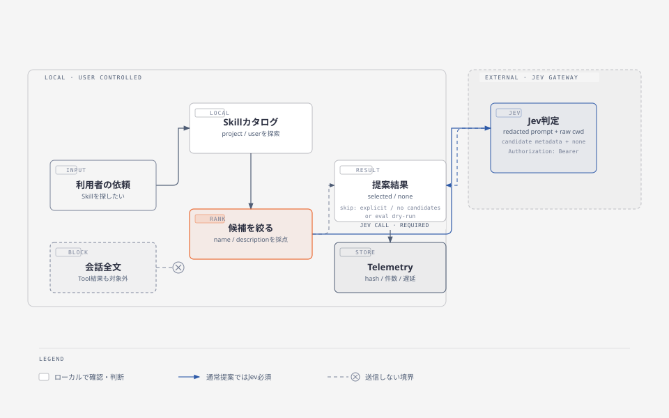
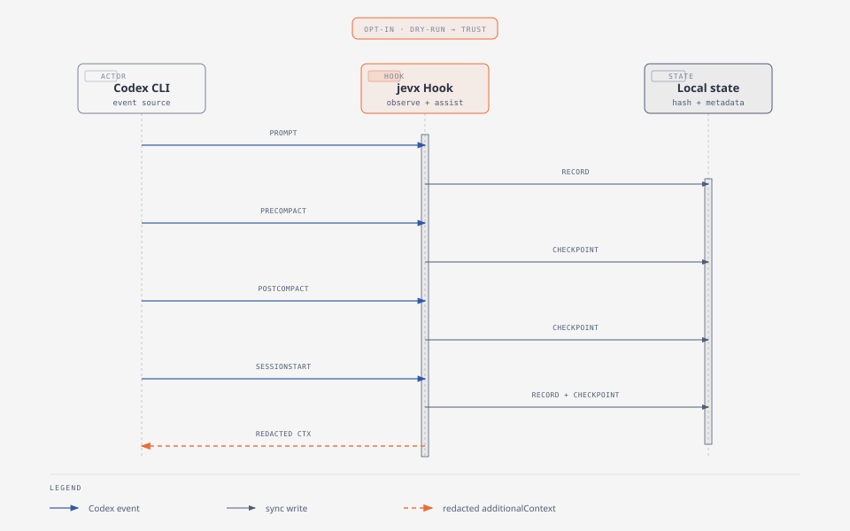
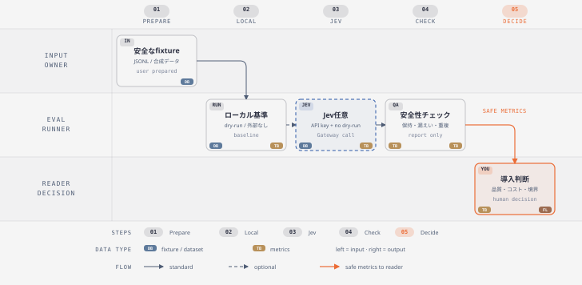

# jevxの始め方

このページは、Codex CLIへ `jevx` を導入するか判断したい人向けの入口です。jevxが何を補助し、Jevを使わない場合と何が変わるか、どの条件で導入を見送るべきかを、現在の実装と記録済みの評価に基づいて説明します。

## 先に結論

`jevx`は、Codex CLIのSkill選択を提案し、選択しない `none` も含めて判断結果を計測するmacOS向けRust CLIです。基本動作はShadow Modeで、提案されたSkillを自動でロード・実行したり、会話を書き換えたりしません。

固定fixtureの評価では、記録済みのjevx + Jev snapshotはローカルキーワード方式より高い正解率を示しました。一方で、Jev/Gatewayへの外部通信、Token使用量、応答遅延、Provider errorが追加されます。このため、jevxは「必ず速くなる自動化」ではなく、Skill選択の判断と導入効果を観測可能にする補助線として検討してください。`nonePrecision` は実装上の互換JSONキーで、意味は `expected: none` の正解数を分母にした recall（`noneCorrect / expectedNone`）です。

## jevxの機能

jevxは、依頼文と利用可能なSkillの説明を使って「どのSkillが合いそうか」を提案します。現在の実装では次の順で処理します。

1. プロジェクトとユーザー領域のSkillを探索する。
2. Skillの名前・説明をローカルでスコアリングし、最大32件の候補に絞る。
3. 候補と `none` を1回のJev Choiceへ渡す。
4. 確率が0.60以上、かつ1位と2位の差が0.10以上のときだけ `selected` とする。
5. JSONまたは人間向け出力と、遅延・Tokenなどのメタデータを返す。

Jevが利用できない場合はローカル推測をJev結果として扱わず、`missing_api_key`・`timeout`・`provider_error` などを明示します。Jevが正常に応答したうえで確信度が足りない、または通常の候補なしと判定した場合だけ、結果を `none` に倒します。つまり、エラーと通常の安全側判定は別の状態です。

### `error` と通常の `none` を分けて読む

`decision: error` はAPIキー未設定、timeout、Provider応答不正などで判定処理が完了していない状態です。`decision: none`（または `no_candidates`）は処理が完了した正常な未推薦で、`below_probability_threshold`、`below_margin_threshold`、`unknown_choice`、`missing_choice` など、閾値未満や未知のchoiceを安全側に倒した結果を含みます。したがって、`none`をエラー率へ足し戻したり、APIキー・timeoutのエラーを正常な`none`判定として数えたりしないでください。

### 自動実行との境界

通常のSkill提案はShadow Modeです。`selected` になっても、次の処理は行いません。

- Skill本文の自動ロード
- Skillの自動実行や権限付与
- 過去の会話の書き換え
- Tool結果や会話全文の要約・削除

Codex Hookを使う場合は、利用者が明示的に `hooks install` を実行し、生成された設定をreview/trustします。Hookの `UserPromptSubmit` は候補・Jev判定を観測し、Compaction関連Hookは決定的なcheckpointとredacted contextを扱います。Compaction補助は会話履歴の完全復元や公式Compactionの代替ではありません。

## 実利用向け機能

ここでは、普段のCodex作業で利用者が直接メリットを得られる機能を先に説明します。jevxはSkillを勝手に実行するものではなく、「探す」「設定を確認する」「必要な補助を接続する」という利用者の判断を短くする道具です。検証・評価だけを目的とした機能は、後半の[jevxの検証・評価用機能](#jevxの検証評価用機能)に分けています。

<figure>

<figcaption>図1：jevxは「候補を提案する場所」と「利用者が実行を決める場所」を分けます。<a href="diagrams/jevx-overview.html">図をブラウザで開く</a></figcaption>
</figure>

### まず使うなら

最初から検証コマンドを覚える必要はありません。目的に合わせて、次の順で選べばOKです。

- **Skillを探したい**：`jevx skills list`で候補を確認し、`jevx skills suggest`で依頼に合うSkillを提案させる。
- **設定や利用状況を確認したい**：`jevx doctor`で設定を、`jevx stats`でTelemetryの集計を確認する。
- **CodexのHookへ接続したい**：`jevx hooks install --dry-run`で差分を確認してから、明示的に`jevx hooks install`を実行する。
- **長い会話のCompactionを補助したい**：Hook導入後に`jevx hooks compact-assist`を使う。
- **導入効果や安全性を測りたい**：通常利用とは別に、後半の検証・評価機能を使う。

### 1. Skill探索・ローカル順位付け・Jev判定

**こんなときに**：Skillが増えて、依頼ごとにどれを使うか探す時間が気になるとき。

**利用者にとってのメリット**：project/user領域のSkillを一覧で確認し、依頼に合いそうな候補を同じ基準で比較できます。Jevを使う場合も、確信度が低いときは`none`へ倒れるため、「無理に選ばない」判断を測定できます。

**使い方**：まず候補カタログを確認し、その後に依頼文を提案へ渡します。

```bash
jevx skills list --json
jevx skills suggest --prompt "PDFを結合して内容を確認したい" --json
```

**結果の読み方**：`selected`は「使ってよい」という実行許可ではなく、jevxが提案した結果です。`none`は正常な未推薦、`error`はAPIキー不足やtimeoutなどで判定が完了していない状態です。

**境界**：`selected`になってもSkill本文の自動ロード・実行、権限付与、過去会話の書き換えは行いません。最終的なSkill利用は利用者または上位のエージェントが決めます。

### 2. 設定・利用状況の確認（`doctor` / `stats`）

**こんなときに**：jevxを使い始める前に設定を確認したいとき、または普段の利用で判定数・遅延・Token使用量を振り返りたいとき。

**利用者にとってのメリット**：`doctor`で設定状態を確認し、`stats`で判定数・選択率・`none`率・エラー率・遅延・Token集計を見られます。数値を同じ形式で残せるため、感覚ではなく実測で利用状況やトラブルを確認できます。

`doctor`はAPIキーの設定有無、Gateway endpoint、Telemetryの保存先・有効状態などを確認します。APIキーの値そのものは表示せず、実行環境がmacOSであることやmacOS固有設定の検証を保証するコマンドではありません。`stats`は既定の`~/.jevx/events.jsonl`、または`--input`で指定したJSONLを集計します。

```bash
jevx doctor --json
jevx stats --json
jevx stats --input /tmp/jevx-events.jsonl --json
```

**境界**：Telemetryにはprompt本文、APIキー、Jevの`probability`を保存しません。`--no-telemetry`はローカルJSONLへの追記を止めるだけで、Gatewayへの外部送信停止ではありません。外部送信も避ける場合は、APIキーなしの`eval --dry-run`、Skill一覧、診断コマンドを使います。

### 3. Hookの導入（`hooks install`）

**こんなときに**：jevxをCodexへ接続し、Skill候補の観測やCompaction補助をセッションのHookから利用したいとき。

**利用者にとってのメリット**：手作業で設定ファイルを全置換せず、既存設定を保持したままjevxのHookを明示的に追加できます。最初にdry-runで差分を見て、backupとTrustを確認してから導入できるため、戻し方を把握した段階で段階導入できます。登録された`UserPromptSubmit` handlerでは内部的に`hooks shadow`が動きますが、通常利用で毎回この低レベルコマンドを直接実行する必要はありません。

```bash
jevx hooks install --scope user --dry-run --json
jevx hooks install --scope user --json
```

user scopeは`$CODEX_HOME/hooks.json`（未設定なら`~/.codex/hooks.json`）、project scopeは`<repo>/.codex/hooks.json`を更新します。既存ファイルがある場合は初回変更時にbackupが作られます。

**境界**：設定変更はopt-inです。導入後はCodex側でHookの内容をreview/trustする必要があり、ファイルを書けたこととHookが発火することは別に確認します。

### 4. Compaction補助（`hooks compact-assist`）

**こんなときに**：Compaction前後で、次に必要な作業や安全なcheckpointが失われていないか確認したいとき。

**利用者にとってのメリット**：`PreCompact`と`PostCompact`のcheckpointを残し、`SessionStart(source=compact)`で最新のredacted metadataを補助contextとして返せます。長いセッションの切り替わりで「どの作業を続けるか」を再確認しやすくなります。

<figure>

<figcaption>図2：Hookはイベントを観測し、ローカルcheckpointを介してcompact後の補助情報を返します。<a href="diagrams/jevx-hook-compaction.html">図をブラウザで開く</a></figcaption>
</figure>

`SessionStart(source=compact)`で作業内容の補助contextも返したい場合は、作業ディレクトリに`.jevx/compact-context.md`を利用者が作成・更新しておきます。checkpoint自体はイベント名・hash・文字数などだけを保存し、作業本文を復元しません。manifestがない場合は、追加の作業contextは返りません。最大4,000文字までのredaction済み内容だけを補助contextへ渡すため、秘密情報は書かないでください。

```bash
mkdir -p .jevx
printf '%s\n' '# 次に続ける作業' '- 例：テスト結果を確認してからドキュメントを更新する' > .jevx/compact-context.md
printf '%s\n' '{"hook_event_name":"PreCompact","session_id":"demo-session","turn_id":"demo-turn","cwd":"."}' |
  jevx hooks compact-assist --state-dir /tmp/jevx-compaction
```

**境界**：LLM要約器ではなく、会話全文の復元、公式Compactionの再実装、Tool Resultの削除、現在のリポジトリ状態の保証は行いません。返すのは決定的なcheckpoint metadataとredacted contextです。詳しい発火確認・backup・Trust手順は[Codex CLI compaction実運用runbook](../operators/jevx-compaction-operations.md)を参照してください。

## jevxの検証・評価用機能

ここからは、通常のCodex作業で常用する機能ではありません。jevxを導入する前後に、Hookの契約・Skill選択の品質・Compaction補助の安全性を測定したい開発者や運用者向けです。これらのコマンドを実行しても、通常のCodexセッションへSkillを自動適用したり、会話品質を改善したりはしません。

<figure>

<figcaption>図3：評価コマンドは用途別に独立してレポートを出し、結果を利用者が比較して導入判断します。<a href="diagrams/jevx-evaluation.html">図をブラウザで開く</a></figcaption>
</figure>

### 1. 導入前のHook動作確認（`hooks shadow`）

**こんなときに**：Codexの設定を変えずに、Hookがどのイベントで発火し、どんな安全な記録を残すか確かめたいとき。

**検証で分かること**：本番設定へ導入する前に、`UserPromptSubmit`やCompaction関連イベントの入力契約と出力を観測できます。生のpromptやsession IDをログへ残さず、hash・文字数・安全なラベル・遅延などだけで導入前の動作を確認できます。

```bash
printf '%s\n' '{"hook_event_name":"UserPromptSubmit","prompt":"PDFを結合して内容を確認したい","session_id":"demo-session","turn_id":"demo-turn","cwd":"."}' |
  jevx hooks shadow --event UserPromptSubmit --output /tmp/jevx-hooks.jsonl
```

この例は、`AI_GATEWAY_API_KEY` が設定されていると `UserPromptSubmit` のpromptをredact後にGatewayへ送信します。外部送信を避ける導入前確認では、秘密を含まない合成入力を使い、APIキーを未設定にして実行してください。実データを流す場合は、送信境界を確認したうえで実行します。

受け付けるknown eventは`SessionStart`、`PreCompact`、`PostCompact`、`UserPromptSubmit`です。未知event、event不一致、壊れたJSONはエラーになります。

**境界**：`hooks shadow`はCodexの設定を変更せず、Skill本文や追加の会話contextを返しません。`hooks install`後の通常利用ではHookから呼び出されるため、手動実行は導入確認や不具合切り分けのときだけ行います。

### 2. Hook記録の診断（`hooks correlate`）

**こんなときに**：Hook recordを複数回採取した後、イベント数や重複発火が想定どおりか確認したいとき。

**検証で分かること**：生のpromptやIDを再表示せず、保存済みhashと安全なmetadataだけで重複・イベント分布を確認できます。Hook導入後の「二重登録されていないか」「想定イベントが来ているか」の切り分けに使えます。

```bash
jevx hooks correlate --input /tmp/jevx-hooks.jsonl --json
```

**境界**：出力はrecord数、event counts、重複集計などの安全な集計に限定され、会話全文や生IDを復元する機能ではありません。通常利用のために定期実行するコマンドではなく、記録を調べるときの診断用です。

### 3. Skill選択の品質・ばらつき測定（`eval` / `eval-repeat`）

**こんなときに**：Skill選択を導入する前に、既存のローカル方式とJev方式の品質・速度・ばらつきを同じfixtureで比べたいとき。

**検証で分かること**：固定fixtureを使うため、条件を揃えてbaselineを再現できます。`eval-repeat`なら1回の良い結果だけでなく、run間の精度・遅延・Token分布・エラー率を見て、導入時の揺れも判断できます。

```bash
jevx eval --dry-run --json
jevx eval-repeat --runs 5 --dry-run --json
```

上の例は、`jevx/evals/skill-selection.jsonl` と`jevx/evals/skills`が存在するリポジトリルートから実行してください。`setup.sh`で配布されるのはバイナリと`SKILL.md`で、評価fixtureは別ディレクトリへ自動コピーされません。別の場所から実行する場合は、対象リポジトリのfixtureを`--fixtures`と`--skill-dir`で明示します。

`--dry-run`ではGatewayへ送らず、Jevモードは`not_run`です。Jev自体を測る場合は、APIキーを環境変数へ設定し、`--dry-run`を外して実行します。出力レポートにはprompt本文やfixtureのkeywordsを保存しません。

**境界**：固定fixtureの結果は実ユーザー全般の品質保証ではありません。外部通信とToken使用量を許容できる条件か、実利用側の`stats`と併せて確認してください。

### 4. Compaction契約の安全性評価（`hooks compact-eval`）

**こんなときに**：Compaction補助の安全性契約を、APIキーや実Codexなしで繰り返し確認したいとき。

**検証で分かること**：合成fixtureで、保持したい事実が残るか、秘密値のfixture markerが漏れないかなどを導入前に確認できます。実会話を保存せずに、評価器と集計ロジックの回帰を検査できます。

```bash
jevx hooks compact-eval --runs 5 --json
```

**境界**：これは固定fixtureの契約・安全性評価です。固定fixtureでは復旧関連値が常に未要求・未完了で、Token usageも`None`として生成されるため、実運用の復旧性能やToken使用量を測定するコマンドではありません。Codex内部の要約モデルやApp Serverも呼び出しません。

### 5. 匿名化会話JSONLの評価（`hooks conversation-eval`）

**こんなときに**：実測した会話を匿名化・整形したJSONLから、保持率・漏えい・遅延・復旧を集計したいとき。

**検証で分かること**：生の会話をリポジトリへ置かず、必要な評価項目だけを残した入力から、比較可能なレポートを作れます。follow-up本文やsecret marker本文はレポートへ再出力されません。

```bash
jevx hooks conversation-eval \
  --input /tmp/jevx-conversation-cases.jsonl \
  --json \
  --output /tmp/jevx-conversation-report.json
```

**境界**：コマンドは入力JSONLを自動削除しません。会話やsecret markerを含む一時ファイルは、測定結果を確認した後に利用者が手動で破棄してください。

Skill選択の評価計画と、入力・出力スキーマの詳細は[jevx評価計画](../developers/jevx-evaluation.md)にまとめています。外部サービスを使う実測は、APIキーを環境変数だけで設定し、合成・匿名化fixtureに限定してください。

## 現行baseline（Latest）

次の値は、外部送信なしの `eval --dry-run --json` を2026-09-22に実行した現行baselineです。`nonePrecision` は上記のとおり `expectedNone` 分母の recall であり、通常の「noneを予測した全件を分母にするprecision」ではありません。

| 項目 | 値 |
| --- | --- |
| 実行日時 | `2026-09-22T15:00:42+09:00` |
| commit | `ed0b93c023251400bcbbe2de8cdedd5451f08761` |
| fixture SHA-256 | `a450a48fac7b49b544002f8c539b961fef0352951cde950f692768b4ea0748fb` |
| Rust / Cargo | `rustc 1.98.1 (48a229cea 2026-09-01)` / `cargo 1.98.1 (797e8a9bc 2026-08-05)` |
| OS | macOS 26.6.2（build 25G83） |
| 実行条件 | `JEVX_TELEMETRY=off`、APIキーなし、fixture 9 Skill + 既定roots（有効候補14）、外部Gateway呼び出しなし |
| カタログ条件 | 評価用 `--skill-dir jevx/evals/skills` を指定。Latest値の再現は同じHOME/CODEX_HOME/project roots、fixture-only再現は隔離root |

| 方式 | cases | 正解率 | `nonePrecision`（`expectedNone` 分母の recall） | 外部通信 |
| --- | ---: | ---: | ---: | --- |
| `none` | 40 | 10.0% | 100.0%（4/4） | なし |
| `local_keyword` | 40 | 87.5% | 75.0%（3/4） | なし |
| `local_rank` | 40 | 17.5% | 75.0%（3/4） | なし |
| `jevx` | 0 | — | — | `not_run`（dry-run） |

再現コマンドは次のとおりです。

```bash
JEVX_TELEMETRY=off cargo run --locked --manifest-path jevx/Cargo.toml -- \
  eval \
  --fixtures jevx/evals/skill-selection.jsonl \
  --skill-dir jevx/evals/skills \
  --dry-run --json
```

このLatest baselineは実行時のSkillカタログ、OS、Rust/Cargo、fixture、環境変数に依存します。とくにevalはproject `.agents/skills` / `.codex/skills`、`HOME/.agents/skills`、`CODEX_HOME/skills`も探索するため、Latest値を再現するには記録時と同じrootsを保持してください。一時HOME・CODEX_HOME・空のproject rootと明示したfixture Skill rootは、fixture-onlyの隔離再現に使います（値はLatestと異なり得ます）。手順は[評価計画](../developers/jevx-evaluation.md)にあります。

## Historical snapshot（2026-09-21）

同梱の9件の評価用Skillと40ケース（合成30件、匿名化テンプレート10件）を使った、APIキーありの歴史的snapshotです。単回結果は40ケースを1回、複数回結果は同じ条件を5回、合計200ケースで測定しました。実装コミット、Gateway/model、OS、fixture hashなどは各レポートの測定条件を参照し、現行baselineと混ぜないでください。

| 方式 | 正解率 | `nonePrecision`（`expectedNone` 分母の recall） | 外部通信・遅延・使用量 |
| --- | ---: | ---: | --- |
| 選択なし (`none`) | 10.0% | 100.0% | 外部通信なし |
| ローカルキーワード | 90.0% | 75.0% | 外部通信なし |
| jevx + Jev（1回） | 100.0% | 100.0% | Jev p50/p95 407/673ms、平均 2,401.175 input / 127.675 output tokens |
| jevx + Jev（5回平均） | 98.0% | 100.0% | エラー率2.0%、探索 p50/p95 2/2ms、Jev p50/p95 427/610ms |

5回測定では、200ケース中4件がProvider errorでした。Jevが成功した196件を対象に、全体時間のp50/p95は429/612msです。したがって、jevxの主な追加コストはローカル探索ではなく、Jev/Gatewayへの通信とそのToken使用量です。

この表は固定fixture・特定のモデル・Gateway・ネットワーク条件に対する観測値です。実ユーザーの依頼全般、将来のモデル、長期SLO、費用を保証するものではありません。評価の条件・再現手順・限界は[導入効果評価](../research/evaluations/jevx-comfort-evaluation.md)と[複数回実測レポート](../research/evaluations/jevx-variance-evaluation-2026-09-21.md)に記録しています。現行値はこの表からではなく、上のLatest baselineから取得してください。

### 導入の動機になりやすいケース

次のような場合は、jevxの評価価値があります。

- 利用可能なSkillが増え、依頼ごとの手動選択に負担がある。
- `none`を含む候補判断を、同じ指標で比較・再測定したい。
- Jevへの送信、Token使用量、遅延、Provider errorを運用上受け入れられる。
- Shadow Modeで提案だけを受け、最終的なSkill利用を自分で確認したい。
- HookやCompaction補助を、既存のCodex設定を確認しながら段階的に導入できる。

### 先に見送るべきケース

- 外部通信を一切許可できない、またはAPIキーを外部サービスへ送れない。
- 追加の数百ms規模の応答時間やToken使用量を許容できない。
- Skillを自動実行する仕組みを期待している。
- 固定fixtureの数値を自分の実ユーザーケースの保証として扱う必要がある。
- HookのTrust、バックアップ、ログの保存場所をレビューできない。

## データの扱いと安全性

Jevへの外部リクエスト境界は次のとおりです。

| データ | Gatewayへ送るか | 実装上の扱い |
| --- | --- | --- |
| 現在のprompt | 送る（redact後） | `token` / `api_key` / `secret` / `password` / `authorization` のキーに続く値、単独のBearer値、`sk-` / `tsk-` tokenを固定パターンでredact |
| `cwd` | 送る（raw） | 作業ディレクトリはハッシュ化せず入力に含める。パス名に秘密を置かない |
| Skill ID / name | 送る（raw） | 候補識別のため送る |
| Skill description | 送る（redact後） | promptと同じ限定パターンのredaction。Skill本文は送らない |
| APIキー | 送る（`Authorization: Bearer`ヘッダー） | request bodyやTelemetryには含めない |
| Skill本文 | 送らない | v1の送信対象外 |
| 自動取得した過去の会話、Tool結果 | 送らない | v1で自動追加しない。promptへ貼付した内容はredact後のpromptとして送信対象 |

Basic redactionは、`Authorization=Basic <value>`、`Authorization:Basic <value>`、`Authorization: Basic <value>` の認識済み形式を保護します。通常文中の単独の単語 `Basic` は意味を保つためredactしません。未知のPII・ラベルなし秘密まで除去する完全なDLPではないため、送信前に内容を確認してください。

Jevを使う通常の提案では、APIキーはGatewayへの`Authorization: Bearer`認証ヘッダーとして送信されます。request bodyやTelemetryへ保存されるものではありませんが、APIキーを外部Gatewayへ渡せない環境ではJev判定を使わないでください。

会話やTool結果をprompt本文へ利用者が貼り付けた場合、その部分は現在のpromptの一部としてredact後にGatewayへ送信されます。自動取得した履歴やTool結果をjevxが追加することはありません。

メールアドレス、電話番号、顧客情報、ラベルのない認証情報など、上記パターンに該当しない機密情報は自動除去されません。外部送信してよい内容だけを入力し、必要に応じて送信前に匿名化してください。

既定Telemetryは `~/.jevx/events.jsonl` に、依頼文そのものではなくハッシュ、文字数、判定（decision）、選択されたSkill ID、候補数、遅延、Token使用量を保存します。Gatewayの回答に含まれる候補確率（probability）はTelemetry schemaへ保存しません。保存を無効にする場合は `--no-telemetry` を使い、集計は `jevx stats --json` で確認します。

```bash
jevx stats --json
jevx skills suggest --prompt "テストを追加して失敗原因を調べたい" --json --no-telemetry
```

`--no-telemetry` はローカルJSONL記録を止めるだけで、Gatewayへの外部送信を止めるスイッチではありません。外部送信も避ける場合は、APIキーなしの `eval --dry-run`、一覧、診断、または明示Skillを使ってください。

Hookを導入するとCodex設定ファイルが変更されます。最初は `--dry-run` で内容を確認し、使い捨ての `CODEX_HOME` で発火とログ相関を検証してください。詳細は[Codex CLI compaction実運用runbook](../operators/jevx-compaction-operations.md)にあります。

## jevxを試す

### ユーザー領域へセットアップ

Rust stableとCargoを用意し、リポジトリのルートで実行します。`setup.sh` の主な引数は `--scope user|project [--repo PATH] [--hooks]` で、ヘルプは `--help` / `-h` で表示できます。ここではworktreeの`target`に依存しないrelease配置を `$HOME/.local/bin` に固定します。別の配置を使う場合は `JEVX_INSTALL_ROOT` を変更してください。

```bash
jevx_install_root="${JEVX_INSTALL_ROOT:-$HOME/.local}"
JEVX_INSTALL_ROOT="$jevx_install_root" sh jevx/scripts/setup.sh --scope user
export PATH="$jevx_install_root/bin:$PATH"
jevx doctor --json
```

Jevを使った提案にはAPIキーが必要です。値をコミット、ログ出力、画面共有しないでください。

```bash
export AI_GATEWAY_API_KEY="<your-ai-gateway-api-key>"
jevx skills suggest --prompt "PDFを結合して内容を確認したい" --json
```

プロジェクトだけに導入する場合は次を使います。`--repo` はproject scopeのSkill配置先を指定します。

```bash
jevx_install_root="${JEVX_INSTALL_ROOT:-$HOME/.local}"
JEVX_INSTALL_ROOT="$jevx_install_root" sh jevx/scripts/setup.sh --scope project --repo "$PWD"
```

### 外部送信なしで確認する

APIキーなしで評価Runnerの構造とローカルベースラインを確認するには、`eval --dry-run --json` を使います。Jevモードは `not_run` と表示されます。

```bash
JEVX_TELEMETRY=off cargo run --locked --manifest-path jevx/Cargo.toml -- \
  eval --dry-run --json
```

### 導入前の確認項目

- [ ] `jevx doctor --json` が成功する。
- [ ] APIキーを環境変数だけで設定し、履歴やログへ出していない。
- [ ] `--no-telemetry` と `jevx stats --json` の違いを確認した。
- [ ] `--no-telemetry` は外部送信停止ではなく、Telemetryのprobabilityも保存されないことを確認した。
- [ ] Jev送信境界（raw cwd、Skill metadata、redacted prompt/description、非送信の会話・Tool結果）を確認した。
- [ ] 固定fixtureの結果を自分のケースの保証として扱っていない。
- [ ] Hook導入前に `hooks install --dry-run --json` を確認した。
- [ ] 実セッションではCodexの `/hooks` でTrustを確認した。

## 次に読む

- [ドキュメント入口](../README.md)
- [jevx 要件定義と実装状況](../developers/jevx-requirements.md)
- [jevx アーキテクチャ](../developers/jevx-architecture.md)
- [jevx 評価計画](../developers/jevx-evaluation.md)
- [Codex CLI compaction実運用runbook](../operators/jevx-compaction-operations.md)
- [Jevあり/なしの導入効果評価](../research/evaluations/jevx-comfort-evaluation.md)
