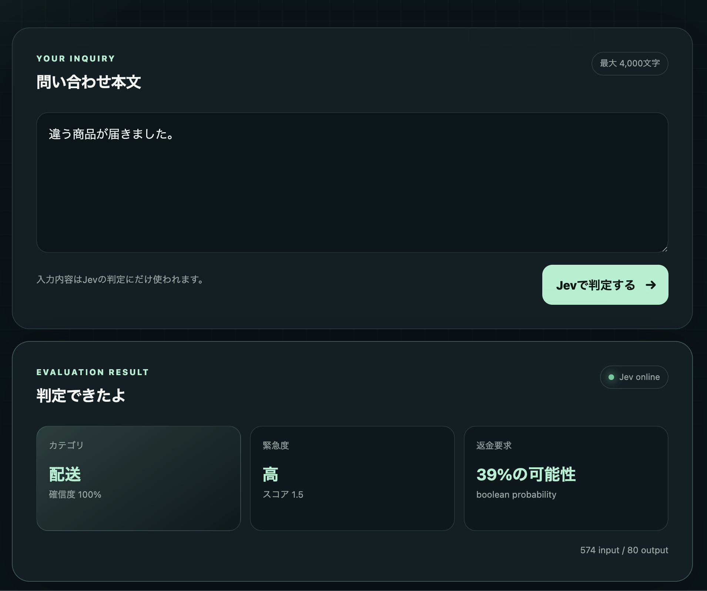
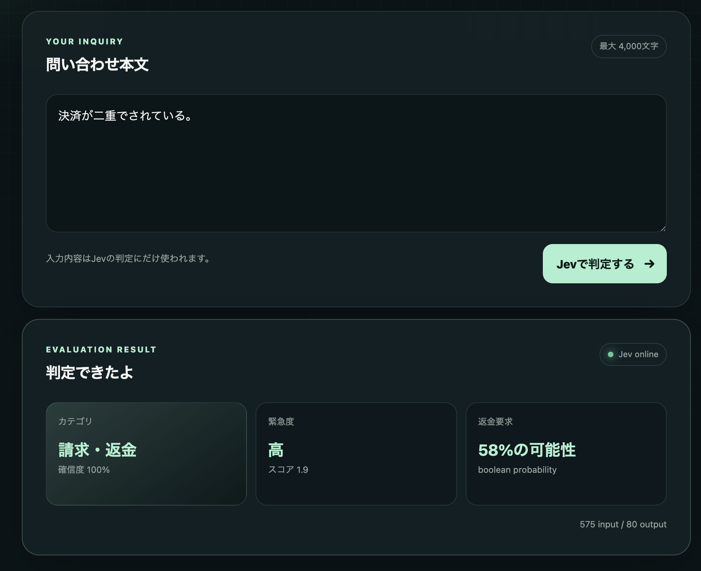
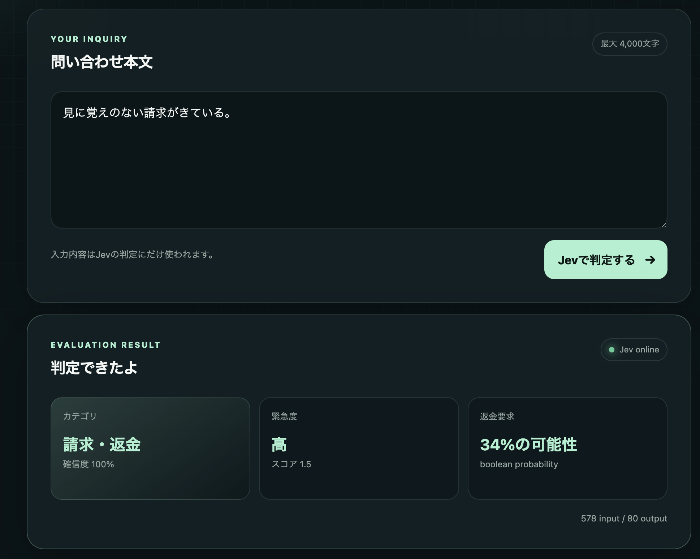

# Jev Triageとjevxの始め方

このページは、Jev Triageを試したい人と、Codex CLIへ `jevx` を導入するか判断したい人向けの入口です。jevxが何を補助し、Jevを使わない場合と何が変わるか、どの条件で導入を見送るべきかを、現在の実装と記録済みの評価に基づいて説明します。

## 先に結論

`jevx`は、Codex CLIのSkill選択を提案し、選択しない `none` も含めて判断結果を計測するmacOS向けRust CLIです。基本動作はShadow Modeで、提案されたSkillを自動でロード・実行したり、会話を書き換えたりしません。

固定fixtureの評価では、Jevx + Jevはローカルキーワード方式より高い正解率と `none` 精度を示しました。一方で、Jev/Gatewayへの外部通信、Token使用量、応答遅延、Provider errorが追加されます。このため、jevxは「必ず速くなる自動化」ではなく、Skill選択の判断と導入効果を観測可能にする補助線として検討してください。

## Jev Triageでできること

Jev Triageは、問い合わせ文をJevへ送り、次の型付き結果を画面に表示します。

- `choice`: 請求・返金、アカウント、不具合、配送のカテゴリ
- `score`: 対応の緊急度
- `boolean`: 返金要求の可能性
- Jevの応答時間とToken使用量

### 起動

必要なものはNode.js 20以上とVercel AI GatewayのAPIキーです。APIキーをブラウザへ渡さないよう、評価リクエストはNode.jsサーバーから送信します。

```bash
export AI_GATEWAY_API_KEY="<your-ai-gateway-api-key>"
npm test
npm run dev
```

ブラウザで <http://localhost:3000> を開いて問い合わせを入力してください。APIキーが未設定でも画面は表示できますが、判定にはキーが必要です。

### 画面例







Jevの型付き評価やTypeSafe APIを直接呼び出す例は、[TypeSafe APIを直接使う](../developers/typesafe-api.md)を参照してください。

## jevxの機能

jevxは、依頼文と利用可能なSkillの説明を使って「どのSkillが合いそうか」を提案します。現在の実装では次の順で処理します。

1. プロジェクトとユーザー領域のSkillを探索する。
2. Skillの名前・説明をローカルでスコアリングし、最大32件の候補に絞る。
3. 候補と `none` を1回のJev Choiceへ渡す。
4. 確率が0.60以上、かつ1位と2位の差が0.10以上のときだけ `selected` とする。
5. JSONまたは人間向け出力と、遅延・Tokenなどのメタデータを返す。

Jevが利用できない場合にローカル推測をJev結果として扱うのではなく、`missing_api_key` やタイムアウトなどを明示する設計です。判断できないときは `none` に倒します。

### 自動実行との境界

通常のSkill提案はShadow Modeです。`selected` になっても、次の処理は行いません。

- Skill本文の自動ロード
- Skillの自動実行や権限付与
- 過去の会話の書き換え
- Tool結果や会話全文の要約・削除

Codex Hookを使う場合は、利用者が明示的に `hooks install` を実行し、生成された設定をreview/trustします。Hookの `UserPromptSubmit` は候補・Jev判定を観測し、Compaction関連Hookは決定的なcheckpointとredacted contextを扱います。Compaction補助は会話履歴の完全復元や公式Compactionの代替ではありません。

## Jevあり / なしの比較

同梱の9件の評価用Skillと40ケース（合成30件、匿名化テンプレート10件）を使った記録では、次の差が観測されています。単回結果は40ケースを1回、複数回結果は同じ条件を5回、合計200ケースで測定したものです。

| 方式 | 正解率 | `none` 精度 | 外部通信・遅延・使用量 |
| --- | ---: | ---: | --- |
| 選択なし (`none`) | 10.0% | 100.0% | 外部通信なし |
| ローカルキーワード | 90.0% | 75.0% | 外部通信なし |
| jevx + Jev（1回） | 100.0% | 100.0% | Jev p50/p95 407/673ms、平均 2,401.175 input / 127.675 output tokens |
| jevx + Jev（5回平均） | 98.0% | 100.0% | エラー率2.0%、探索 p50/p95 2/2ms、Jev p50/p95 427/610ms |

5回測定では、200ケース中4件がProvider errorでした。Jevが成功した196件を対象に、全体時間のp50/p95は429/612msです。したがって、Jevxの主な追加コストはローカル探索ではなく、Jev/Gatewayへの通信とそのToken使用量です。

この表は固定fixture・特定のモデル・Gateway・ネットワーク条件に対する観測値です。実ユーザーの依頼全般、将来のモデル、長期SLO、費用を保証するものではありません。評価の条件・再現手順・限界は[導入効果評価](../research/evaluations/jevx-comfort-evaluation.md)と[複数回実測レポート](../research/evaluations/jevx-variance-evaluation-2026-09-21.md)に記録しています。

### 導入の動機になりやすいケース

次のような場合は、jevxの評価価値があります。

- 利用可能なSkillが増え、依頼ごとの手動選択に負担がある。
- `none`を含む候補判断を、同じ指標で比較・再測定したい。
- Jevへの送信、Token使用量、遅延、Provider errorを運用上受け入れられる。
- Shadow Modeで提案だけを受け、最終的なSkill利用を自分で確認したい。
- HookやCompaction補助を、既存のCodex設定を確認しながら段階的に導入できる。

### 先に見送るべきケース

- 外部通信を一切許可できない、またはAPIキーを外部サービスへ送れない。
- 追加の数百ms規模の応答時間やToken使用量を許容できない。
- Skillを自動実行する仕組みを期待している。
- 固定fixtureの数値を自分の実ユーザーケースの保証として扱う必要がある。
- HookのTrust、バックアップ、ログの保存場所をレビューできない。

## データの扱いと安全性

Jevへ送るのは、実装が認識するパターンをredactした現在の依頼文、作業ディレクトリ、SkillのID・名前・説明です。`token` / `api_key` / `secret` / `password` / `authorization` のキーに続く値、Bearer/Basic形式の値、`sk-` / `tsk-` で始まるTokenなどはredactされます。設定に使うAPIキー自体、Skill本文、過去の会話、Tool結果は送信しません。

メールアドレス、電話番号、顧客情報、ラベルのない認証情報など、上記パターンに該当しない機密情報は自動除去されません。外部送信してよい内容だけを入力し、必要に応じて送信前に匿名化してください。

既定Telemetryは `~/.jevx/events.jsonl` に、依頼文そのものではなくハッシュ、文字数、判定、候補数、遅延、Token使用量を保存します。保存を無効にする場合は `--no-telemetry` を使い、集計は `jevx stats --json` で確認します。

```bash
jevx stats --json
jevx skills suggest --prompt "テストを追加して失敗原因を調べたい" --json --no-telemetry
```

Hookを導入するとCodex設定ファイルが変更されます。最初は `--dry-run` で内容を確認し、使い捨ての `CODEX_HOME` で発火とログ相関を検証してください。詳細は[Codex CLI compaction実運用runbook](../operators/jevx-compaction-operations.md)にあります。

## jevxを試す

### ユーザー領域へセットアップ

Rust stableとCargoを用意し、リポジトリのルートで実行します。ここではworktreeの`target`に依存しないrelease配置を `$HOME/.local/bin` に固定します。別の配置を使う場合は `JEVX_INSTALL_ROOT` を変更してください。

```bash
jevx_install_root="${JEVX_INSTALL_ROOT:-$HOME/.local}"
JEVX_INSTALL_ROOT="$jevx_install_root" sh jevx/scripts/setup.sh --scope user
export PATH="$jevx_install_root/bin:$PATH"
jevx doctor --json
```

Jevを使った提案にはAPIキーが必要です。値をコミット、ログ出力、画面共有しないでください。

```bash
export AI_GATEWAY_API_KEY="<your-ai-gateway-api-key>"
jevx skills suggest --prompt "PDFを結合して内容を確認したい" --json
```

プロジェクトだけに導入する場合は次を使います。

```bash
sh jevx/scripts/setup.sh --scope project --repo "$PWD"
```

### 外部送信なしで確認する

APIキーなしで評価Runnerの構造とローカルベースラインを確認するには、dry-runを使います。Jevモードは `not_run` と表示されます。

```bash
cargo run --locked --manifest-path jevx/Cargo.toml -- \
  eval --dry-run --json
```

### 導入前の確認項目

- [ ] `jevx doctor --json` が成功する。
- [ ] APIキーを環境変数だけで設定し、履歴やログへ出していない。
- [ ] `--no-telemetry` と `jevx stats --json` の違いを確認した。
- [ ] 固定fixtureの結果を自分のケースの保証として扱っていない。
- [ ] Hook導入前に `hooks install --dry-run --json` を確認した。
- [ ] 実セッションではCodexの `/hooks` でTrustを確認した。

## 次に読む

- [ドキュメント入口](../README.md)
- [jevx 要件定義と実装状況](../developers/jevx-requirements.md)
- [jevx アーキテクチャ](../developers/jevx-architecture.md)
- [jevx 評価計画](../developers/jevx-evaluation.md)
- [Codex CLI compaction実運用runbook](../operators/jevx-compaction-operations.md)
- [Jevあり/なしの導入効果評価](../research/evaluations/jevx-comfort-evaluation.md)
